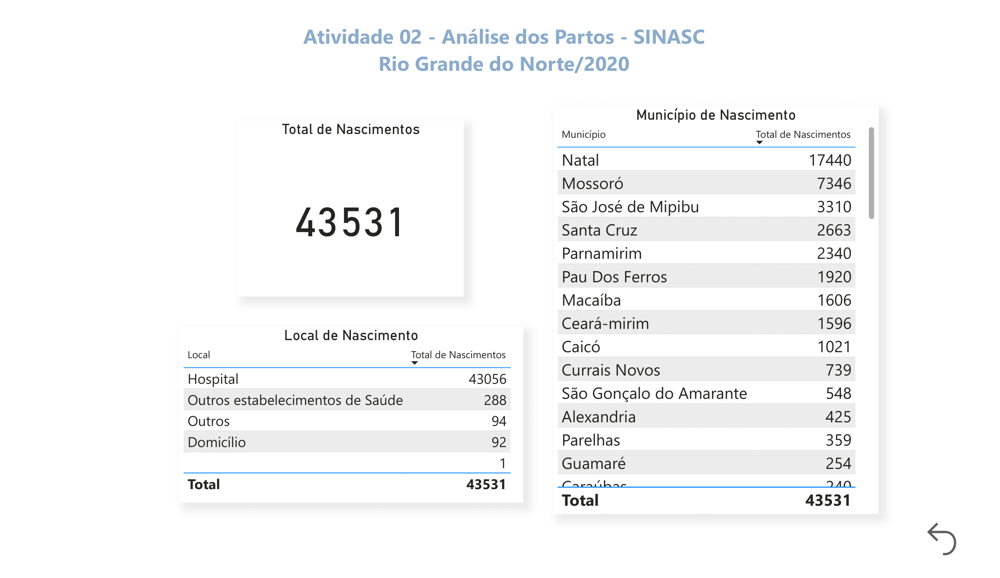
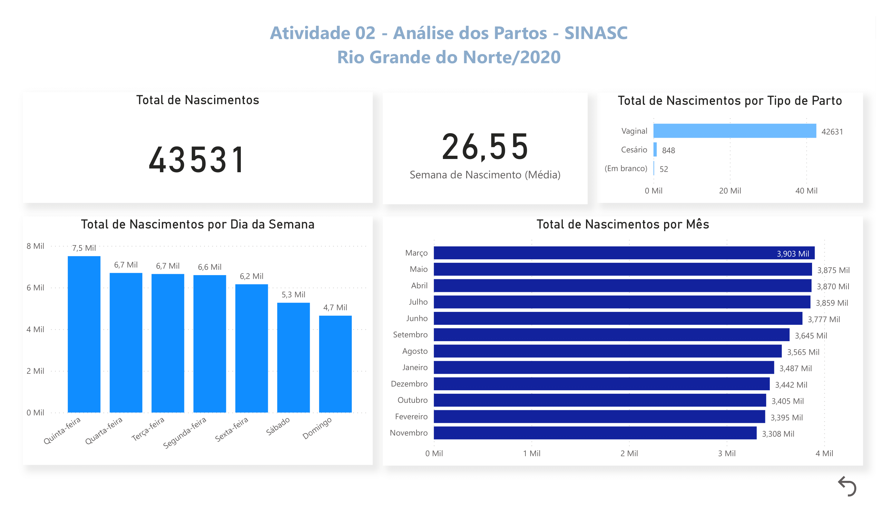

# 🤰 Análise dos Partos – SINASC 2020 (Rio Grande do Norte)

> 🇬🇧 *Scroll down for the English version.*

Este projeto foi desenvolvido como parte da Especialização em Ciência de Dados e Saúde Digital da Universidade Federal de Pernambuco (UFPE).

Utilizando o Power BI, explorei dados públicos do SINASC (Sistema de Informações sobre Nascidos Vivos) para analisar os partos ocorridos no estado do Rio Grande do Norte no ano de 2020. O objetivo foi identificar indicadores relevantes relacionados ao perfil materno e aos desfechos dos nascimentos.

---

## 🎯 Objetivos

- Explorar os dados de nascimentos por local, período e perfil da mãe  
- Visualizar padrões quanto ao tipo de parto, idade gestacional e escolaridade  
- Aplicar técnicas de visualização interativa com Power BI

---

## 🛠️ Ferramentas utilizadas

- Power BI Desktop  
- Base pública do SINASC – 2020

---

## 📸 Capturas de Tela

  

---

## 🔍 Principais insights

- Mais de **98% dos partos** ocorreram em hospitais  
- Partos normais e cesáreos foram quase igualmente distribuídos  
- A maioria das mães tinha entre 8 e 11 anos de escolaridade  
- A maior parte dos nascimentos ocorreu entre **37 e 41 semanas**  
- Quinta-feira e o mês de março registraram mais nascimentos

---

## 📁 Arquivos

- `sinasc_birth_analysis_rn_2020.pbix`: arquivo Power BI  
- Imagens do painel em `.png`

---

---

# 🤰 Birth Analysis – SINASC 2020 (Rio Grande do Norte, Brazil)

This project was developed as part of the Data Science and Digital Health specialization at UFPE (Federal University of Pernambuco, Brazil).

Using Power BI, I explored public data from SINASC (Brazil’s Live Births Information System) to analyze childbirth patterns in the state of Rio Grande do Norte during the year 2020. The project aimed to identify key indicators related to maternal characteristics and delivery outcomes.

---

## 🎯 Objectives

- Explore childbirth data by location, time, and maternal profile  
- Visualize patterns in delivery type, gestational age, and education level  
- Apply interactive data visualization techniques using Power BI

---

## 🛠️ Tools Used

- Power BI Desktop  
- SINASC (Live Births Information System) – 2020 dataset (public)

---

## 📸 Screenshots

  

---

## 🔍 Key Insights

- Over **98% of births** occurred in hospitals  
- Normal (vaginal) and cesarean deliveries were nearly balanced  
- The majority of mothers had between 8 and 11 years of schooling  
- Most births occurred between **37–41 weeks** of gestation  
- Births were slightly more frequent on **Thursdays** and in **March**

---

## 📁 Files

- Power BI dashboard  
- Dashboard screenshots in `.png`
